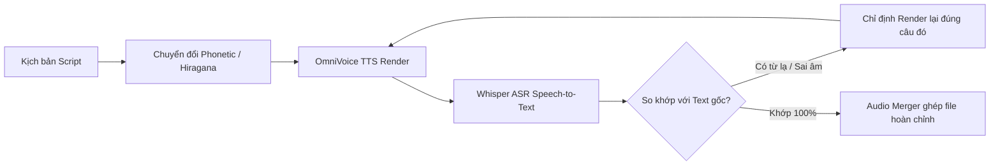

# SỔ TAY KINH NGHIỆM TỐI ƯU KỊCH BẢN AI VOICE / TTS TIẾNG NHẬT
> **Dành cho:** OmniVoice, CosyVoice, StyleTTS2, VITS, Voicevox và các mô hình Zero-shot Voice Cloning.  
> **Mục tiêu:** Loại bỏ 100% lỗi đọc lặp từ, vấp tiếng, phát âm sai chữ Hán (Kanji), đọc sai thuật ngữ quân sự/khoa học và lỗi số đếm.

---

## 📌 I. TỔNG QUAN: VÌ SAO AI VOICE TIẾNG NHẬT DỄ BỊ LỖI?

Các mô hình AI Voice tiếng Nhật chuyển đổi văn bản sang âm thanh qua cơ chế **G2P (Grapheme-to-Phoneme)**. Tiếng Nhật là ngôn ngữ phức tạp bậc nhất cho G2P vì:
1. **Một chữ Hán có nhiều cách đọc:** Âm On (On'yomi), âm Kun (Kun'yomi), âm biến thể (Nanori) và âm biến âm (Rendaku).
2. **Thuật ngữ chuyên ngành / quân sự:** Rất nhiều từ không nằm trong từ điển phổ thông của AI (như `圧壊`, `隔壁`, `気閘`, `暗順応`).
3. **Mô hình Deep Learning dự đoán theo xác suất:** Khi gặp từ lạ, AI sẽ tự đoán âm gần nhất hoặc chắp vá các âm đơn lẻ, dẫn đến hiện tượng đọc ngọng, líu lưỡi hoặc tạo chuỗi âm vô nghĩa.

---

## 🚫 II. BẢY BẪY LỖI KINH ĐIỂN & QUY TẮC KHẮC PHỤC

### 1. Bẫy số 1: "Đọc lặp từ / Glitch vấp tiếng" do dùng ngoặc đơn chú thích
- **Hiện tượng:** Giọng đọc bị lắp bắp, đọc 2 lần một từ (ví dụ: *“角壁、角壁が結界して…”* hoặc *“炎素酸ナトリウム、炎素酸ナトリウム…”*).
- **Nguyên nhân:** Người viết kịch bản thường quen tay thêm Furigana giải nghĩa dạng:
  - `隔壁（かくへき）`
  - `塩素酸ナトリウム（えんそさんナトリウム）`
  - `静水圧（せいすいあつ）`
  - `爆縮（ばくしゅく）`
  **Hệ quả:** Mô hình TTS đọc **CẢ chữ bên ngoài VÀ chữ bên trong ngoặc**!
- ⚡ **Quy tắc vàng:** **TUYỆT ĐỐI KHÔNG DÙNG CẶP NGOẶC CHÚ THÍCH PHIÊN ÂM `Hán（Hiragana）` TRONG VĂN BẢN TTS.**
- **Cách sửa đúng:**
  - Nếu chữ Hán đó AI đọc đúng: Để nguyên chữ Hán (`爆縮`, `静水圧`).
  - Nếu chữ Hán đó AI đọc sai: **Đổi hẳn 100% sang Hiragana hoặc Katakana** (ví dụ đổi thành `かくへき`, `ばくしゅく`).

---

### 2. Bẫy số 2: Chữ Hán đa âm & Từ vựng quân sự / hàng hải đặc thù
Dưới đây là các ca lỗi thực tế đã giải quyết triệt để:

| Từ gốc | Lỗi AI đọc sai | Nghĩa bị sai lệch | Cách viết tối ưu cho TTS | Giải thích & Kết quả |
| :--- | :--- | :--- | :--- | :--- |
| **水音** | *Suzoton / 鈴音* | Âm lạ vô nghĩa | **みずおと** | Nghĩa là "tiếng nước chảy". Viết Hiragana để AI đọc chuẩn xác *Mizuoto*. |
| **隔壁** | *Kakahi / かか比* | Đọc sai âm On | **かくへき** | Vách ngăn kín nước/chịu áp trên tàu ngầm (*Kakuheki*). Viết Hiragana triệt tiêu hoàn toàn lỗi. |
| **圧壊** | *Atsukai / 扱い* | Bị nhầm thành "đối xử / thao tác" | **あっかい** (hoặc `あっかい事故`) | Nổ bẹp/sụp đổ do áp suất lớn (*Akkai*). Giữ chữ Hán kịch bản nhưng nạp Hiragana cho voice. |
| **南大西洋** | *Minami-Taiseishō* (南大成小) | Đọc nhầm chữ `洋` (*yō*) thành *shō* | **みなみたいせいよう** | Nam Đại Tây Dương. Phiên âm Hiragana chuẩn để phát âm đúng âm đuôi *-yō*. |
| **鉄の棺桶** | *Tetsu no kansui oke* | Nhận diện sai chữ 棺 thành *Kansui* | **「てつのかんおけ」** | Hội chứng "chiếc quan tài sắt". Viết Hiragana đặt trong ngoặc kép để giữ nhịp nhấn. |
| **米潜水艦** | *Kome sensuikan* | Đọc chữ `米` thành "gạo" | **アメリカ潜水艦** | Tàu ngầm Mỹ. Thay chữ Hán đơn lẻ bằng Katakana tên quốc gia. |
| **水深600m** | *Suifun / Mizubuka* | Đọc sai chữ 深 | **すいしん600メートル** | Độ sâu. Viết `すいしん` để khóa cứng cách đọc chuẩn *Suishin*. |
| **暗順応** | *Anjunnō* bị ngọng | Thích nghi bóng tối | **あんじゅんのう** | Thuật ngữ y sinh hải quân. Viết Hiragana đọc mượt 100%. |

---

### 3. Bẫy số 3: Tàu ngầm hạt nhân bị líu lưỡi (`原子力潜水艦`)
- **Hiện tượng:** Tại các đoạn câu dài nhiều phụ âm nối tiếp, AI đọc vấp thành *“Genshirosu… sensuikan”* (原子ロス).
- **Cách khắc phục:** Tách nhẹ âm tiết đầu:
  - ❌ Gốc: `世界最先端の原子力潜水艦が…`
  - ✅ Sửa: `世界最先端のげんしりょく潜水艦が…`
  - **Kết quả:** AI đọc cực kỳ trôi chảy, tròn vành rõ chữ *Genshiryoku sensuikan*.

---

### 4. Bẫy số 4: Từ viết tắt tiếng Anh & Đơn vị đo áp lực (PSI, SEIE, ROV, DSRV)
- **Ký hiệu PSI (Pound per square inch):**
  - ❌ Viết dính: `14.7PSI` $\rightarrow$ AI đọc líu thành "14.7プシ" hoặc bị ngắt cụt.
  - ✅ Viết chuẩn: `14.7 ピー・エス・アイ` (hoặc `900 ピー・エス・アイ`).
  - *Lợi ích:* Dấu chấm giữa các âm giúp AI có khoảng dừng micro-pause tự nhiên để phát âm từng chữ cái P-S-I.
- **Tên thiết bị viết tắt (SEIE, ROV, DSRV):**
  - Khi đi kèm tên tiếng Nhật, cần thêm trợ từ ngữ pháp tự nhiên:
    - ❌ Cũ: `SEIE、潜水艦脱出スーツと呼ばれる…`
    - ✅ Mới: `SEIE、潜水艦脱出用スーツと呼ばれる…` (thêm chữ **用** - *chuyên dùng cho*).
    - Viết `アールオーブイ・遠隔操作無人探査機` và `ディーエスアールブイ・深海救難艇` nếu muốn AI đọc chuẩn cả chữ viết tắt lẫn tên gọi.

---

### 5. Bẫy số 5: Dịch thuật ngữ cảnh sai lệch (Rừng rậm vs Biển sâu)
- **Hiện tượng:** Video nói về tàu ngầm dưới đáy biển nhưng kịch bản dịch máy ra `漆黒の森林` (*Khu rừng đen kịt*).
- **Khắc phục:** Luôn kiểm duyệt từ vựng đúng trường nghĩa:
  - ❌ Sai ngữ cảnh: `漆黒の森林の前では` (Trước khu rừng đen kịt...)
  - ✅ Đúng chuẩn: `漆黒の深海の前では` (Trước vực thẳm biển sâu đen kịt...)

---

### 7. Bẫy số 7: Dồn dập danh từ ghép dài gây ngợp & líu lưỡi (Compound Noun Glitch)
- **Hiện tượng:** Khi để nhiều danh từ ghép chuyên ngành liên tiếp trong 1 hơi thở (ví dụ: `18層の闇に隠された古代の超巨大生存要塞`), AI TTS sẽ bị quá tải bộ đệm, đọc vấp trẹo âm (*choukyodai seizon yousai* bị líu thành âm rác) hoặc ngắt hơi gượng gạo.
- **Cách khắc phục:** 
  - Tách câu ngắn độc lập (25–40 ký tự / câu).
  - Thêm dấu ngắt nhịp tự nhiên `、`:
    - ❌ Cũ: `古代の超巨大生存要塞です`
    - ✅ Mới: `古代の、きょだいな生存要塞です。`
  - **Kết quả:** Âm thanh rõ ràng từng âm tiết, giọng đọc trầm ấm và uy lực.

---

### 8. Bẫy số 8: Lỗi nuốt số tầng (`18層`) và lỗi nối âm số đếm (`地下85m`)
- **Số tầng bị nuốt thành "sho...":**
  - Số Latinh `18` đứng cạnh chữ `層` khiến bộ tách từ G2P đoán nhầm thành âm câm hoặc đọc cụt đầu *sho...*.
  - ❌ Gốc: `18層`
  - ✅ Khắc phục: Chuyển hẳn sang Hiragana **`じゅうはっそう`** (*Jū-hassō*).
- **Lỗi dính chữ nối âm số đo:**
  - Viết dính `地下85メートル` hoặc `地下はちじゅうごメートル` dễ khiến AI nối âm đọc lướt thành *“Chika-wa chijuugometoru”* (nghe nhầm thành số 70/chijū).
  - ❌ Cũ: `地下85メートル`
  - ✅ Mới: `地下、はちじゅうごメートル。` (Thêm dấu phẩy tách bạch chữ Hachi).

---

### 9. Bẫy số 9: Lỗi lệch Ref Text gây ảo giác (Hallucination)
- **Hiện tượng:** AI tự sinh ra triết lý ngoài lề (*最高の報酬は...*) hoặc tạp âm lạ (*うぇしん おしと...*).
- **Nguyên nhân:** Khai báo sai văn bản mẫu (`ref_text`) không khớp 100% với file audio mẫu (`voice.mp3`).
- **Quy tắc vàng:** Luôn dùng Whisper ASR để transcribe chính xác 100% từng từ trong file `voice.mp3` trước khi nạp vào cấu hình Voice Clone.

---

### 10. Bẫy số 10: Kiểm soát nhịp thở (Pacing) & Phát âm lượng từ đặc thù
- **Kỹ thuật nối hơi bằng dấu phẩy `、` thay vì dấu chấm `。`:**
  - Dấu chấm `。` khiến AI ngắt hơi hẳn 0.5s - 0.8s, làm đứt đoạn cảm xúc khi câu sau bắt đầu bằng các liên từ chuyển tiếp (`そこに...`, `そして...`).
  - ❌ Gắt nhịp: `トルコの荒涼とした大地の地下85メートル。そこには…`
  - ✅ Nối hơi tự nhiên: `トルコの荒涼とした大地の地下85メートル、そこには、2万人以上の命をかくすに足る超巨大地下都市が存在しています。`
- **Quy tắc lượng từ vật dụng:**
  - `1本のハンマー`: Đảm bảo AI đọc là **`いっぽん`** (*ippon*), không đọc rời *ichi-hon*.
  - `18層`: Khóa cứng **`じゅうはっそう`** (*jū-hassō*), không đọc tách *jū-hachi-sō*.
- **Tốc độ vàng (Golden Speed Ratio):**
  - Giữ tốc độ ở mức **1.1x – 1.15x** cho các video tài liệu khoa học/khám phá để mở màn có độ dồn dập, cuốn hút người xem ngay từ những giây đầu tiên.

---

## 🛠️ III. QUY TRÌNH KIỂM ĐỊNH CHẤT LƯỢNG (QC PIPELINE)

Để không phải mất 15-20 phút ngồi nghe thủ công từng file và dễ bỏ sót lỗi nhỏ, hãy áp dụng quy trình tự động hóa sau:

### 1. Dùng Whisper ASR để "nghe hộ":
Sau khi render file WAV, chạy model `openai/whisper-small` (hoặc medium) chuyển audio ngược lại thành text tiếng Nhật:
- Nếu file đọc đúng `みずおと`, Whisper sẽ trả về chữ `水音`.
- Nếu file đọc sai `すぞとん`, Whisper sẽ trả về chữ `鈴音` hoặc âm lạ $\rightarrow$ Phát hiện lỗi ngay lập tức.
- Nếu file đọc đúng `あっかい`, Whisper sẽ nhận diện âm `悪海` / `圧壊`. Nếu đọc sai thành `あつかい`, Whisper sẽ hiện rõ chữ `扱い`!

### 2. Kỹ thuật "Render mục tiêu" (Targeted Re-render):
- Trên CPU, mỗi phân đoạn mất khoảng 40 - 60 giây. Nếu cả bài có 91 câu, render toàn bộ sẽ mất gần **1 tiếng**.
- **Giải pháp:** Chỉ nạp model 1 lần duy nhất, giữ nguyên 85 câu đã chuẩn, chỉ nạp render lại đúng 5-6 câu có chỉnh sửa. Thời gian render rút ngắn còn **3-4 phút**!

### 3. Quy tắc quản lý file ghép nối (Final Merge):
- Khoảng nghỉ khuyến nghị giữa các câu phim tài liệu khoa học: **0.4 giây** (gap breathing).
- **Luôn xóa các file gộp cũ (`FINAL_MERGED_*.wav`)** trước khi tạo bản mới để tránh người dùng hoặc hệ thống lấy nhầm file chưa sửa.

---

## 📋 IV. BẢNG TỔNG HỢP TRA CỨU NHANH (CHEATSHEET)

| Trường hợp | Cách viết SAI (Tránh dùng) | Cách viết ĐÚNG (Khuyên dùng cho AI Voice) |
| :--- | :--- | :--- |
| **Chú thích phiên âm** | `漢字（ふりがな）` | Đổi hẳn sang `ふりがな` |
| **Chữ Hán hiếm/đa âm** | `水音`, `隔壁`, `圧壊`, `気閘` | `みずおと`, `かくへき`, `あっかい`, `エスケープ・トランク` |
| **Đơn vị ký tự** | `14.7PSI`, `900PSI` | `14.7 ピー・エス・アイ`, `900 ピー・エス・アイ` |
| **Từ dễ líu lưỡi** | `原子力潜水艦` | `げんしりょく潜水艦` |
| **Tên riêng nước ngoài** | `サンファン`, `タイタン` | `「サン・ファン」`, `「タイタン」` |
| **Từ chỉ quốc gia đơn**| `米海軍`, `米潜水艦` | `アメリカ海軍`, `アメリカ潜水艦` |
| **Độ sâu / Số đo** | `水深600m` | `すいしん600メートル` |
| **Ngắt nhịp câu** | Dùng dấu phẩy `,` hoặc `、` | Thêm dấu chấm ngắt câu `。` để tạo nhịp lấy hơi tự nhiên |

---

*Tài liệu được đúc kết từ quá trình triển khai & tối ưu thực tế hệ thống OmniVoice Studio.*
